# Service category hierarchy

**Rule:** We always have **subcategories** (level 2). **Questions are attached only to subcategories.**  
Welpers choose a subcategory when creating an offering (e.g. Babysitter, Dog Walks, Housekeeping). Level-1 categories (Care, Pet Care, etc.) are for grouping only and have no questions.

---

## Mermaid diagram

```mermaid
flowchart TD
  subgraph L1["Level 1 — Categories (grouping only, no questions)"]
    Care
    PetCare["Pet Care"]
    Education
    InHome["In-Home Maintenance"]
    Exterior["Exterior Maintenance"]
    Health["Health & Wellness"]
    Entertainment
  end

  subgraph CareSub["Care"]
    Babysitter
    ChildCare["Child Care"]
    ElderlyCare["Elderly Care"]
    SpecialNeeds["Special Needs"]
  end

  subgraph PetSub["Pet Care"]
    DogWalks["Dog Walks"]
    PetGrooming["Pet Grooming"]
    Aquarium["Aquarium and Terrarium Cleaning/Maintenance"]
    DogTraining["Dog Training"]
    PetSitting["Pet-sitting"]
  end

  subgraph EduSub["Education"]
    Tutoring
    MusicLessons["Music Lessons"]
  end

  subgraph InHomeSub["In-Home Maintenance"]
    Housekeeping
    Painting
    Organizing
    Moving
    Installation
  end

  subgraph ExteriorSub["Exterior Maintenance"]
    LawnCare["Lawn Care"]
    Gardening
    CarWashing["Car Washing"]
    Seasonal["Seasonal Maintenance"]
  end

  subgraph EntSub["Entertainment"]
    Catering
    PartyPlanning["Party-planning"]
    Magician
    Clown
    Server
    AssistantParty["Assistant for Party"]
    Bartender
  end

  subgraph HealthSub["Health & Wellness"]
    MealPrep["Meal Preparation"]
    PersonalTrainer["Personal Trainer"]
    Dietician
    Nutritionist
  end

  Care --> Babysitter & ChildCare & ElderlyCare & SpecialNeeds
  PetCare --> DogWalks & PetGrooming & Aquarium & DogTraining & PetSitting
  Education --> Tutoring & MusicLessons
  InHome --> Housekeeping & Painting & Organizing & Moving & Installation
  Exterior --> LawnCare & Gardening & CarWashing & Seasonal
  Entertainment --> Catering & PartyPlanning & Magician & Clown & Server & AssistantParty & Bartender
  Health --> MealPrep & PersonalTrainer & Dietician & Nutritionist
```



---

## Tree view (text)

```
Care  (level 1 — no questions)
├── Babysitter
├── Child Care
├── Elderly Care
└── Special Needs

Pet Care  (level 1 — no questions)
├── Dog Walks
├── Pet Grooming
├── Aquarium and Terrarium Cleaning/Maintenance
├── Dog Training
└── Pet-sitting

Education  (level 1 — no questions)
├── Tutoring
└── Music Lessons

In-Home Maintenance  (level 1 — no questions)
├── Housekeeping
├── Painting
├── Organizing
├── Moving
└── Installation

Exterior Maintenance  (level 1 — no questions)
├── Lawn Care
├── Gardening
├── Car Washing
└── Seasonal Maintenance

Health & Wellness  (level 1 — no questions)
├── Meal Preparation
├── Personal Trainer
├── Dietician
└── Nutritionist

Entertainment  (level 1 — no questions)
├── Catering
├── Party-planning
├── Magician
├── Clown
├── Server
├── Assistant for Party
└── Bartender
```

---

## Summary

| Category (level 1)     | Subcategories (level 2) — questions attach here |
|------------------------|--------------------------------------------------|
| Care                   | Babysitter, Child Care, Elderly Care, Special Needs |
| Pet Care               | Dog Walks, Pet Grooming, Aquarium and Terrarium…, Dog Training, Pet-sitting |
| Education              | Tutoring, Music Lessons |
| In-Home Maintenance    | Housekeeping, Painting, Organizing, Moving, Installation |
| Exterior Maintenance   | Lawn Care, Gardening, Car Washing, Seasonal Maintenance |
| Health & Wellness      | Meal Preparation, Personal Trainer, Dietician, Nutritionist |
| Entertainment          | Catering, Party-planning, Magician, Clown, Server, Assistant for Party, Bartender |

*Source: `apps/bff/src/database/seeds/seed-content.ts`*
